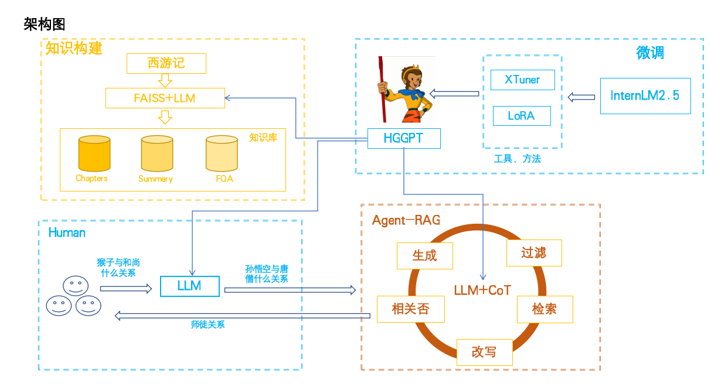

# 猴哥GPT
“黑神话：悟空”这款3A游戏掀起了一片悟空热，越来越多的人们对《西游记》背后的文化底蕴和精彩故事感兴趣，但又被一本厚厚的书籍所打。hougeGPT是一个使用InternLM2调的大模型，通过使用RAG技术和mulitAgent技术，构建的回答关于西游记里面人物的关系和精彩故事的大模型，首先通过将西游记中小说注入到知识库中，在人们通过hougeGPT沟通过程中，多个Agent共同协作响应，实现与人们互动，让人们聊聊天就能对《西游记》背后的文化底蕴和精彩故事了解。

## 技术路线
RAG（Retrieval Augmented Generation）技术，通过检索与用户输入相关的信息片段，并结合外部知识库来生成更准确、更丰富的回答。解决 LLMs 在处理知识密集型任务时可能遇到的挑战, 如幻觉、知识过时和缺乏透明、可追溯的推理过程等。提供更准确的回答、降低推理成本、实现外部记忆。Agent可以控制大模型的输出
## 整体架构图

## 智能体架构图


## 应用搭建
### clone仓库
将项目clone到本地

```sh
git clone https://github.com/aizhweiwei/hougeGPT.git
```

### 创建环境
建议创建一个虚拟环境，然后安装依赖包

```sh
conda create --name hougeGPT python=3.10

conda activate hougeGPT
cd hougeGPT
pip install -r requirements.txt
```

### 安装其他软件
首先安装git和git-lfs
```sh
sudo apt install git
sudo apt install git-lfs
```

### 一键启动服务
``` sh
python3 app.py
```
在启动过程中，会下载相关模型，这个时间会比较久，你也可以注释相关下载模型代码，并提前下载相关模型，同时修改config.ini文件配置模型位置

### 非一键启动
1、注释app.py下载模型文件代码
```python
# download internlm2 to the base_path directory using git tool
# base_path = './final_model'
# os.system(f'git clone https://openxlab.org.cn/models/detail/bob12/hougeGPT {base_path}')
# embedding_path = './bce-embedding-base_v1'
# os.system(f'git clone https://www.modelscope.cn/maple77/bce-embedding-base_v1.git {embedding_path}')
# reranker_path = './bce-reranker-base_v1'
# os.system(f'git clone https://www.modelscope.cn/maple77/bce-reranker-base_v1.git {reranker_path}')
# os.system(f'cd {base_path} && git lfs pull')
# os.system(f'cd {embedding_path} && git lfs pull')
# os.system(f'cd {reranker_path} && git lfs pull')
```
2、下载模型
```sh
git clone https://openxlab.org.cn/models/detail/bob12/hougeGPT
git clone https://www.modelscope.cn/maple77/bce-embedding-base_v1.git
git clone https://www.modelscope.cn/maple77/bce-reranker-base_v1.git

```

3、修改config.ini文件
```bash
embedding_model_path = "/group_share/model/bce-embedding-base_v1"
reranker_model_path = "/group_share/model/bce-reranker-base_v1"
local_llm_path = "/group_share/model/final_model"

```
将上面路径修改你下载的路径，最好使用绝对路径

4、启动
``` sh
python3 app.py
```
---

## 致谢


***感谢 上海人工智能实验室 组织的书生·浦语大模型实战营学习活动 和 提供的强大算力支持~***

***感谢 OpenXLab 对项目部署的算力支持~***

***感谢 浦语小助手 对项目的支持~***
